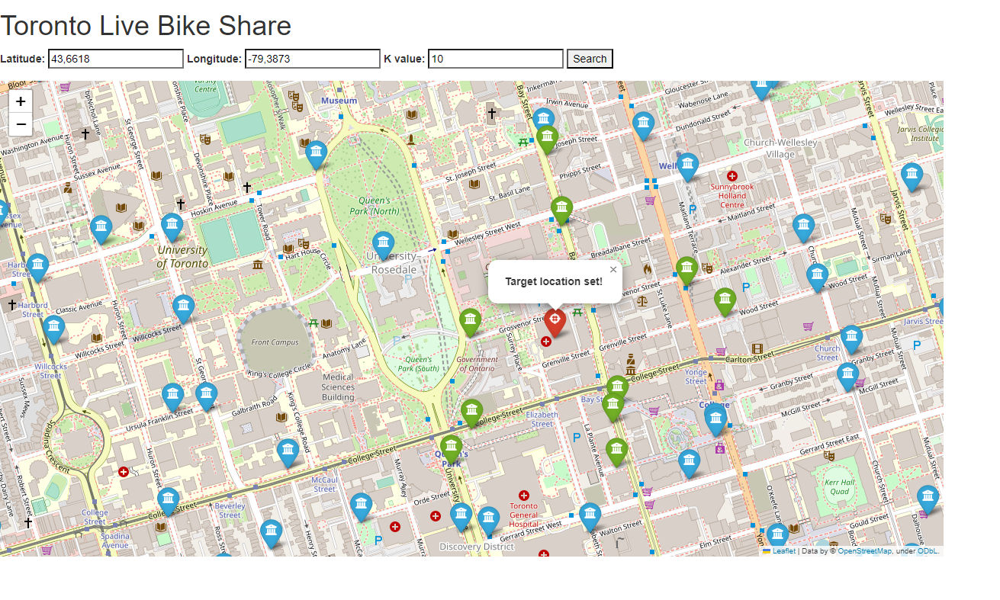

# Toronto Live Bikes Share Flask Web App 

## Goal
The goal of the project is to create a web app with user interface.

## Main functionalities
Find K avaialble bikes nearby to the user using the given location.

The main page view:

- The red marker represents the position of user
- Blue markers represent available stations
- Green markers represent the nearest K available stations

