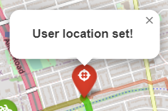

# Toronto Live Bikes Share Flask Web App 

## The goal of the project
The goal of the project is to create a [Flask](https://flask.palletsprojects.com/en/2.3.x/) web application which allows searching for available bikes and docks in Toronto.
The application uses live data from the bike sharing system [Bike Share Toronto](https://bikesharetoronto.com/). 

### Bike Share Toronto 
The system offers 24/7 convenient access to 7,246 bikes (6722 mechanical and 524 electric) and 668 stations across Toronto’s vast biking network. 

<p align="center">
  
<br>
Image source: <a href="https://en.wikipedia.org/wiki/Bike_Share_Toronto">Wikipedia</a>
</p>


Bike Share Toronto publishes JSON files which updates in real-time by connecting to the Bike Share backend software. The open API transmits live data under the General Bikeshare Feed Specification (GBFS).

In order to get the live data the following links can be used:
 - [station status](https://tor.publicbikesystem.net/ube/gbfs/v1/en/station_status) - the data describes the capacity and rental availability of the stations. The documentation is available [here](https://github.com/MobilityData/gbfs-json-schema/blob/master/v2.3/station_status.json).
 - [station information](https://tor.publicbikesystem.net/ube/gbfs/v1/en/station_information) - the data contains details about the station including system operator, location, year implemented, etc. The documentation is available [here](https://github.com/MobilityData/gbfs-json-schema/blob/master/v2.3/station_status.json).
 
 
The data about the station status and station information can be joined using the identification number of the station.
This way the number of available bikes and docks at the particular station can be obtained.

## Installation

### Install virtualenv
[Virtualenv](https://www.freecodecamp.org/news/how-to-setup-virtual-environments-in-python/) is a tool to create isolated Python environments.
It can be installed using the package manager [pip](https://pip.pypa.io/en/stable/).
```bash
pip install virtualenv
```

###Create a virtual environment
In order to create a virtual environment use the following command. Specify python version and the name of your virtual environment.
```bash
python<version> -m venv <virtual-environment-name>
```
for example:
```bash
python3.10 -m venv venv
```

### Activate virtual environment
To activate your virtual environment on **Mac** or **Linux**, run the code below:
```bash
source venv/bin/activate
```
To activate your virtual environment on **Windows**, run the code below:
```bash
venv/Scripts/activate.bat //In CMD
venv/Scripts/Activate.ps1 //In Powershell
```

When your virtual environment is ready and active run the command below to install all dependencies within their own copy of the project. 
Use the package manager [pip](https://pip.pypa.io/en/stable/).
```bash
pip install -r requirements.txt
```

## Running the project
Enter the directory *flask_app/* with file *app.py* and run the Python file.
```bash
cd flask_app/
python app.py
```

The application will start on localhost on port 5000.
You can see the results entering this link: [http://127.0.0.1:5000](http://127.0.0.1:5000)

## Main functionalities of the app
### Search for available bikes and docks nearby the specified location
The service is available at [http://127.0.0.1:5000/search_available](http://127.0.0.1:5000/search_available).

The app allows finding K available bikes or docks nearby the given location.
The user can specify the following search parameters:
- Location of the user (latitude and longitude)
- K value - number of the nearest stations to be selected from all stations
- Search type - search for stations with available bikes or docks

The parameters can be inserted into the form:

<p align="center">
  
</p>


When ready, the user clicks the "Search" button and after a moment receives the results - a map with markers and routes.
There are three types of markers: red, blue and green.

#### Red marker
The red marker represents the position of the user.
The marker is draggable (hold left mouse button and move).
After clicking on it, its current location is copied as the search parameter (a popup as confirmation appears).

<p align="center">
  
</p>

#### Green markers
The green marker represents one of K of the nearest available stations.
The station is active and has at least one available bike - mechanical or e-bike.
After clicking on the marker the user can see the details about the station.

This is an example result when K equals 3:

<p align="center">
  
</p>


#### Blue markers
The blue markers represent available stations.
The station is active and has at least one available dock.
After clicking on the marker the user can see the details about the station.

<p align="center">
  
</p>

#### Station details
After clicking on a green or blue marker the user can see the details about the station:
- **Address**
- **Bikes available**
- **Bikes available - mechanical**
- **Bikes available - ebike**
- **Docks available**	
- **Directions** - two buttons (Walking and Cycling) redirect to directions on Google Maps between the user location and the station.

<p align="center">
  
</p>


#### Routes to the nearest markers
The routes to the nearest stations from the user location are found using [openrouteservice free API](https://openrouteservice.org/).
The closer the station to the user's location, the greener, wider and opaquer it is. 
Routes to station in greater distances are redder, less wide and more transparent.

<p align="center">
  
</p>

On hover, the route shows a tooltip "Click for details".

<p align="center">
  
</p>

After clicking the route, its details are shown in a popup.
The identification number of the station connected with this route is displayed.

<p align="center">
  
</p>

### Search for a convenient connection between two locations using Bike Share Toronto system
The service is available at [http://127.0.0.1:5000/search_directions](http://127.0.0.1:5000/search_directions).

Given a source and destination location, the app presents the route on a map and allows to see it in Google Maps as well.

The user can specify the following search parameters:
- Source location (latitude and longitude)
- Destination location (latitude and longitude)

The parameters can be inserted into the form:

<p align="center">
  
</p>

When ready, the user clicks the "Search directions" button and after a moment receives the results - a map with **4 markers** and **3 routes**.

<p align="center">
  
</p>


During searching for the most convenient route, the definition of **4 key locations** is needed:
- **source location** - the initial location of the user; represented with the **red marker**
- **bike station location** - the location of the nearest station from the source location with at least one bike available; represented with the **orange marker**
- **dock station location** - the location of the nearest station from the destination location with at least one dock available; represented with the **blue marker**
- **destination location** - the final location of the user; represented with the **green marker**

Searching for the route includes the following steps:
- search for route **by foot** from the **source location** and the **bike station location**; represented with the **red route**
- search for route **by cycling** from the **bike station location** to the **dock station location**; represented with the **orange route**
- search for route **by foot** from the **dock station location** to the **destination location**; represented with the **blue route**

On hover, the route shows a tooltip "Click for details".

<p align="center">
  
</p>

After clicking the route, its details are shown in a popup.
The locations (longitude and latitude) connected with the route as well as the profile used during searching for directions are displayed.

<p align="center">
  
</p>

On click, the marker displays a popup with its name - it is one of the **4 key locations** defined above.

<p align="center">
  
</p>

After clicking on the "Show directions" button, the user is redirected to directions on Google Maps
between the source location and destination location using the 4 key locations as destinations (stops) during the route.

<p align="center">
  
</p>

## Contributing

Pull requests are welcome. For major changes, please open an issue first
to discuss what you would like to change.

## License

[MIT](https://choosealicense.com/licenses/mit/)

